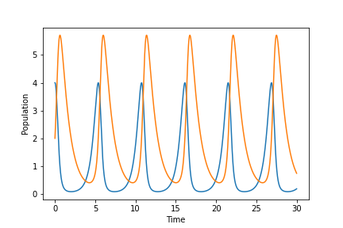

# 10219012
Faiz Aulia Rahman


## Materi sebelumnya
Tuliskan materi-materi sebelumnya yang telah diberikan dalam kuliah ini.
 + Metode Euler
 + Metode Runge Kutta 4
 + Penyelesaian ODE dengan metode di atas
 + Persamaan ODE yang digunakan di antaranya: predator prey, sistem-sistem bandul, osilasi harmonik teredam.
 + Heat diffusion model
 + Transformasi Fourier
 + Metode Monte Carlo

## Materi paling menarik
Tuliskan materi yang paling menarik yang telah diberikan dan jelaskan mengapa menarik.
 + Penyelesaian predator prey
 + Metode Monte Carlo
 + Metode metode penyelesaian ODE seperti Euler atau Runge Kutta 4 
 + Preview fractal menggunakan metode rekursif

## Materi paling membosankan
Tuliskan materi yang telah diberikan yang paling membosankan dan jelaskan alasannya.
 + Heat diffusion model
 + Transformasi Fourier

## Materi yang sudah dipami
Tuliskan materi-materi yang telah dipahami.
 + Metode Runge Kutta 4
 + Monte Carlo

## Materi yang belum dipahami
Tuliskan materi-materi yang masih belum dipahami dan bagian mana yang belum serta ingin dipahami.
 + Transformasi Fourier
 + Penyelesaian ODE yang membutuhkan beberapa layer pemahaman lanjut

## Contoh program
Buat suatu contoh program dalam Python dan sertakan di sini dengan hasil keluarnnya.

```python
def run_kut4(f, x, t, h):                    
        k1 = h*f(x, t)
        k2 = h*f(x+0.5*k1, t+0.5*h)
        k3 = h*f(x+0.5*k2, t+0.5*h)
        k4 = h*f(x+k3, t+h)
        return (k1 + 2*k2 + 2*k3 + k4)/6

def predprey(X, t, k1=2.0, k2=1.0, d=1.0, c=1.0):
    x, y = X
    xdot=k1*x-c*y*x
    ydot=-k2*y+d*y*x
    return np.array([xdot, ydot],float)

h=0.001
tmax = 30                               
T = np.arange(0, tmax, h)         
X, Y  = [], []
r = np.array([4, 2], float)
for t in T:
        X.append(r[0])          
        Y.append(r[1])          
        r += run_kut4(predprey, r, t, h)             

plt.figure()
plt.plot(T, X, label = 'Prey')
plt.plot(T, Y, label = 'Predator')
plt.xlabel("Time")
plt.ylabel("Population")
plt.show()
```

Hasilnya adalah




## Cara perkuliahan
Tuliskan pendapat Anda mengenai cara perkuliahan selama ini dan cantumkan usulan untuk perkuliahan setelah UTS.
 + Perkuliahan dijalani dengan baik. Akan tetapi sulit dijalankan karena pada awal perkuliahan tidak terdapat kelas. Balance antara teori dan aplikasi di awal perkuliahan tidak seimbang dan berasa berasa terlalu berat di prakteknya

## Topik sistem fisis
Tuliskan sistem fisis yang menarik bagi Anda untuk dikaji lebih dalam dan jelaskan alasannya mengapa.
 + Sistem fisis menarik yang ingin diketahui lebih dalam adalah sistem fisis yang menggunakan visualisasi untuk pemahamanmya seperti:
   - Simulasi partikel granular, pergerakan objek dibawah pengaruh gaya atau hambatan udara, atau Computational Fluid Dynamics CFD 


## Simulasi dan visualisasi
Apakah Anda tertarik dengan simulasi dan visualisasi? Jelaskan topik yang ingin Anda simulasikan / visualisasikan serta cantumkan alasannya dan perkiraan pusataka Python yang perlu digunakan.
 + Untuk topik menarik yang membutuhkan simulasi dan visualisasi sendiri pendekatannya sama dengan jawaban di atas. Selama visualisasinya dapat memberikan gambaran menarik tentang suatu sistem, saya tertarik untuk mempelajarinya.
 Salah satunya adalah lattice gas dengan cellular automata, untuk library pythonnya sendiri saya kurang mendalami python sehingga tidak banyak yang saya ketahui perihal library terkait.
